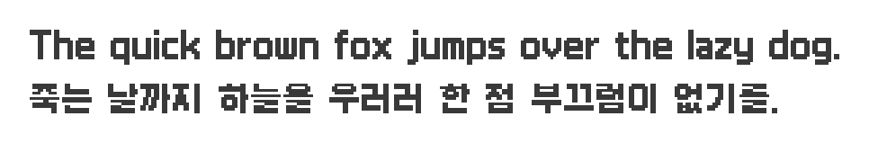

# Galmuri

Outline fonts based on bitmap fonts used in Nintendo DS.

## Preview

- Galmuri11 (12px size) 
- Galmuri11 Bold (12px size) 
- Galmuri9 (10px size) 

## Supported Ranges

| Range                         | Galmuri11          | Galmuri11 Bold     | Galmuri9           |
|-------------------------------|--------------------|--------------------|--------------------|
| Basic Latin                   | :heavy_check_mark: | :heavy_check_mark: | :heavy_check_mark: |
| Latin-1 Supplement            | :heavy_check_mark: |                    | :heavy_check_mark: |
| Latin Extended-A              | :heavy_check_mark: |                    | :heavy_check_mark: |
| Latin Extended-B              |                    |                    |                    |
| Greek and Coptic              | :heavy_check_mark: |                    |                    |
| Cyrillic                      | :heavy_check_mark: |                    |                    |
| General Punctuation           | :heavy_check_mark: | :heavy_check_mark: | :heavy_check_mark: |
| Geometric Shapes              | :heavy_check_mark: | :heavy_check_mark: | :heavy_check_mark: |
| CJK Symbols and Punctuation   | :heavy_check_mark:[^bracket] | :heavy_check_mark:[^bracket] | :heavy_check_mark:[^bracket] |
| Hiragana                      | :heavy_check_mark: |                    | :heavy_check_mark: |
| Katakana                      | :heavy_check_mark: |                    | :heavy_check_mark: |
| Hangul Compatibility Jamo     | :heavy_check_mark: | :heavy_check_mark:[^old] | :heavy_check_mark: |
| CJK Unified Ideographs        | :heavy_check_mark:[^jis] |                    | :heavy_check_mark:[^jis] |
| Hangul Syllables              | :heavy_check_mark:[^han-1] | :heavy_check_mark:[^han] | :heavy_check_mark:[^han] |
| CJK Compatibility Ideographs  | :heavy_check_mark:[^ks] |                    |                    |
| Vertical Forms                | :heavy_check_mark: |                    | :heavy_check_mark: |
| CJK Compatibility Forms       | :heavy_check_mark: |                    | :heavy_check_mark: |
| Halfwidth and Fullwidth Forms | :heavy_check_mark: |                    | :heavy_check_mark: |

[^old]: Excluding old hangul jamo.
[^han]: Only 2,780 hangul syllables included in [Adobe-KR-0](https://github.com/adobe-type-tools/Adobe-KR#supplement-0adobe-kr-0).
[^han-1]: Only 4,358 hangul syllables included in [Adobe-KR-0](https://github.com/adobe-type-tools/Adobe-KR#supplement-0adobe-kr-0) and [Adobe-KR-1](https://github.com/adobe-type-tools/Adobe-KR#supplement-1adobe-kr-1).
[^jis]: Only 6,355 CJK unified ideographs included in JIS X 0208.
[^ks]: Only 268 CJK compatibility ideographs included in KS X 1001.
[^bracket]: Unlike the Unicode Character Database, brackets (`U+3008`-`U+3011`, `U+3014`-`U+301B`) are made in halfwidth like the type it is often used in Korea.

## Todo

- [ ] Adobe-KR-1에 포함된 한글 음절 1,578자 추가
  - [x] Galmuri11
  - [ ] Galmuri11 Bold
  - [ ] Galmuri9
- [ ] KS X 1001에 포함된 한중일 호환용 한자 중 JIS X 0208에 포함되지 않는 268자 추가
  - [x] Galmuri11
  - [ ] Galmuri9
- [ ] KS X 1001에 포함된 한중일 통합 한자 중 JIS X 0208에 포함되지 않는 536자 추가
  - [ ] Galmuri11
  - [ ] Galmuri9

----

Nintendo DS is a trademark of Nintendo.
